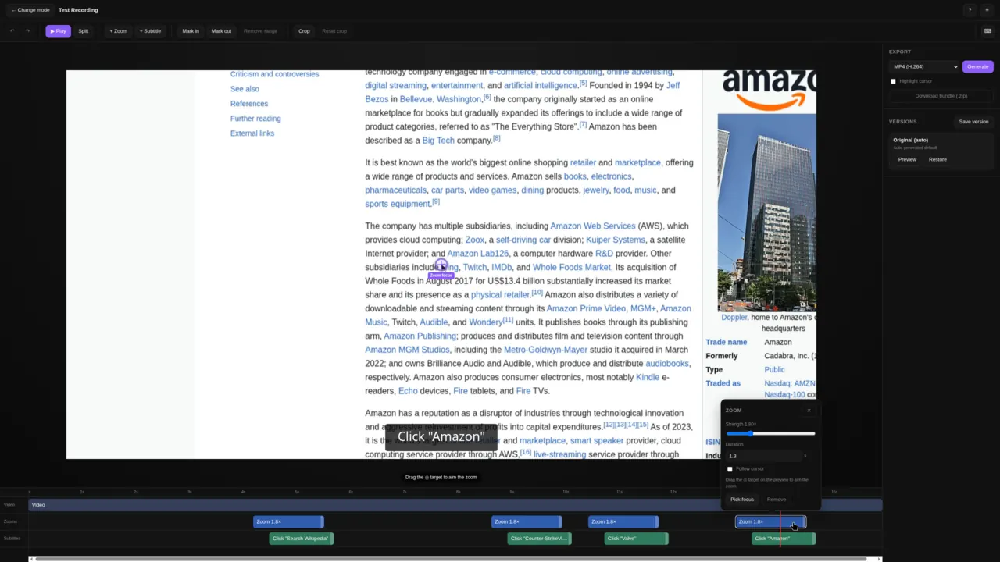
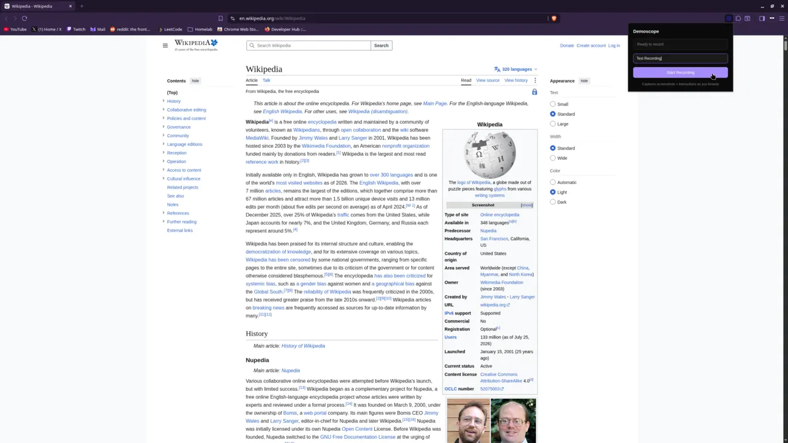
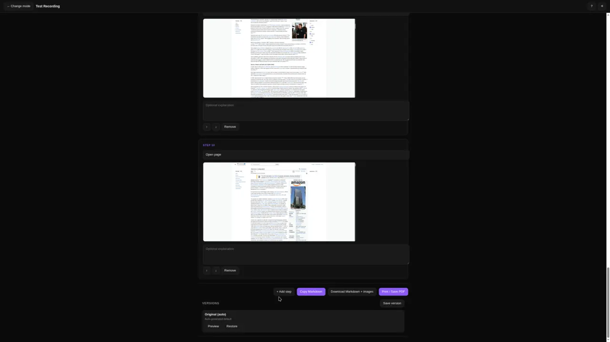

<p align="center"></p>

# demoscope

<p align="center">
  <a href="https://chromewebstore.google.com/detail/demoscope-recorder/klabdpceilpikeogkjhcfaiflekihgoj"></a>
</p>

A Chrome extension that records product walkthroughs in your browser — clicks, typing, scrolling, and navigation, each captured with a screenshot — then turns them into polished **MP4/GIF videos** or **step-by-step documents**, edited entirely in the browser. No Playwright, no CLI, no server: because it records what you actually see, it works on pages behind a login.



## Features

- **One-click recording** — capture clicks, typing, scrolling, key presses, and navigation with a screenshot at every step.
- **Works behind auth** — records your real session, so gated and internal pages just work.
- **In-browser editor** — a timeline editor with trimming, cuts, auto-zoom segments, smooth cursor motion, animated click effects, subtitles, and annotations.
- **Two outputs from one recording** — render a narrated **video** (MP4 or GIF) or generate a **step document** you can copy as Markdown, download with images, or print to PDF.
- **Recording library** — recordings are stored locally; reopen, rename, or delete them any time.

## Install

Install from the [Chrome Web Store](https://chromewebstore.google.com/detail/demoscope-recorder/klabdpceilpikeogkjhcfaiflekihgoj).

Or build it from source and load it unpacked:

```bash
cd extension
npm install
npm run build
```

Then in Chrome:

1. Open `chrome://extensions`
2. Enable **Developer mode** (top right)
3. Click **Load unpacked** and select `extension/dist/chrome`

> MP4 export uses the browser's WebCodecs encoder, which is supported in Chrome. GIF export works everywhere.

## Record a walkthrough

1. Navigate to the page you want to demo (including anything behind a login).
2. Click the **Demoscope** toolbar icon.
3. Optionally enter a title, then click **Start Recording**.
4. Interact with the page — every click, keystroke, scroll, and navigation is captured with a screenshot.
5. Click the icon again and click **Stop & Preview**.

The preview tab opens the editor with your recording loaded.



## Edit and export

From the editor you pick an output for the recording (switch any time — the recording stays put):

- **Video editor** — arrange the timeline (clips, cuts, zoom, subtitles), tune pacing and cursor motion, then export **MP4**, **GIF**, or a **`.zip`** capture bundle.
- **Step document** — an auto-generated, editable list of steps with screenshots. Reorder, retitle, and annotate steps, then **Copy Markdown**, **Download Markdown + images**, or **Print / Save PDF**.



## Development

This is an npm-workspaces monorepo. The extension consumes the shared packages directly at build time (via esbuild), so it lives outside the workspace and installs its own dependencies.

| Package                | Role                                                             |
| ---------------------- | ---------------------------------------------------------------- |
| `packages/schema`      | Shared capture/step type definitions                             |
| `packages/timeline`    | Pure logic: zoom/crop math, cursor interpolation, frame geometry |
| `packages/browser-kit` | Recording storage, capability detection, browser helpers         |
| `packages/editor`      | The Svelte editor UI (video editor + step document)              |

Requires **Node.js 20.19+**.

From the repo root:

```bash
npm install        # install workspace dependencies
npm test           # run the unit tests (vitest)
npm run test:watch # re-run tests on change
npm run lint       # eslint across the packages
npm run format     # format the repo with prettier
npm run build      # type-check the shared packages
```

Build the extension itself from the `extension/` directory:

```bash
cd extension
npm install
npm run build      # bundle to extension/dist/chrome
npm run dev        # rebuild on change
```

Unit tests live next to the code they cover (`packages/*/src/*.test.ts`) and focus on the pure logic — zoom/crop math, cursor interpolation, and the render timeline.

Formatting and linting are enforced on commit: a Husky `pre-commit` hook runs `lint-staged`, which applies ESLint and Prettier to staged files. Hooks are installed automatically via the `prepare` script when you run `npm install`.
